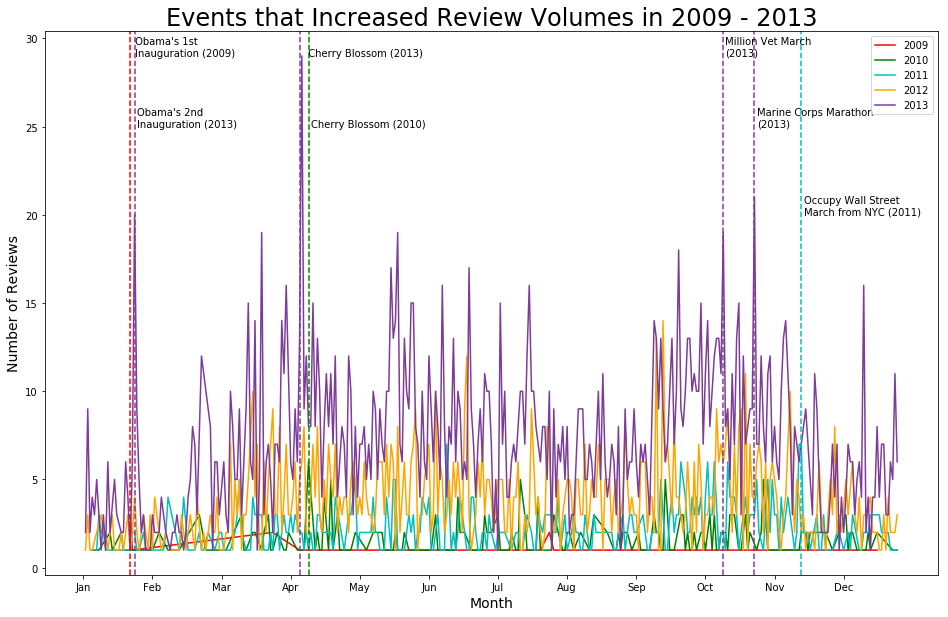

# An Analysis of AirBnB in Washington, D.C.

This repository is for the capstone project I prepared as a Data Science Immersive student at General Assembly. I am continuing to make improvements on this project.

---

## Executive Summary
I love to travel and when I do it, I don't want to feel like a tourist. There is something about checking into a hotel or staying in the area that hotels are normally located in that makes me feel like I don't belong in the place that I'm traveling to. But a reason for traveling is not just to see new things or have new adventures, it's to feel like you belong in a new location. AirBnB offers a way of doing that, by creating a world where you can "belong anywhere", as their slogan suggests. The AirBnB platform is one of those ideas where you say, "Wow, I wish I would have thought of that." Over the last 10 years, it has changed not only the way that people travel, but the housing landscape of cities across the world, for better or worse.
I wanted to look at something that felt close to home, so I collected data on the AirBnB landscape in Washington, D.C. More specifically, I wanted to find interesting relationships in this data that might be insightful for a traveler, for a homeowner, for an AirBnB decision maker, and maybe even for a District housing regulator. 

---

## Problem Statement
To focus my efforts, I wanted to look specificaly at these four questions:
* What overall trends can be found in the data? 
* How does AirBnB data relate to major events that have occurred in the nation's capital over the last 10 years? 
* What factors are most important in predicting price?
* How might AirBnB data affect the housing landscape? 

---

## Table of Contents
* Included in this repository:
    * [Data Dictionary](./code/01-data-dictionary.ipynb)
    * [Data](./data)
    * [Code](./code)
    * [Images](./images)
    * [Presentation PDF](./airbnb-presentation)
* [Data](Data)
* [Analytical Findings](Analytical-Findings)
* [Major Events in D.C. vs Data](Major-Events-in-D.C.-vs-Data)
* [Regulation Background](Regulation-Background)
* [Zeus Analysis](Zeus-Analysis)
* [Modeling](Modeling)
* [Improvements & Next Steps](Improvements-&-Next-Steps)
* [Resources](Resources)

---

## Data 
First I'd like to start by describing the data that I used to answer these questions. There were four datasets that I found on the [InsideAirBnB](http://insideairbnb.com/get-the-data.html) for Washington, D.C. This website houses datasets for AirBnB information in cities across the globe. The site was created with the idea to shine a light on the "for worse" side of AirBnB - the disruption it causes to housing and communities. The information on InsideAirBnB.com is updated by its moderators on an irregular basis, however they have archived data starting from 2015 on. The data used in the project was collected from the AirBnB site in September 2019. These four datasets include:
1. **Listings:** The listings dataset includes the bulk of the data: listing name, locations (latitude/longitude), neighbourhood, host, room_type, price, minimum nights a listing must be booked for, number of reviews for that listing, date of last review, average reviews per month, availability (how many days out of 365 the listing is available for booking), and number of listings per host.
2. **Reviews:** There are almost 360,000 reviews that all correspond with a unique listing id. These are the same listing ids that can be found in the Listings dataset. The dates these reviews were written range from January 2009 up to the time the data was collected.
3. **Neighbourhoods:** This includes a list of 39 defined neighbourhoods as well as a geojson file that defines the boundary coordinates of each neighbourhood.
4. **Calendar:** This dataset represents a 'calendar' of prices and listings for each day for the following year (from the time the data was collected). 

Using the existing data, some additional features were engineered to use in modeling and analysis:
* Distance from listing to the National Mall
* Room type dummy variables
* Neighbourhood dummy variables

A complete data dictionary is available in within this repo: [Data Dictionary](./code/01-data-dictionary.ipynb)

*Please note: the file sizes for this data are quite large. The zipped file I have contains most of the base files, but none of the new dfs created as part of my cleaning and modeling process. 

---

## Analytical Findings
Some of my initial descriptive findings of the data are as follows:
* As of September 2019, there are 9,189 unique listings in D.C. 
* The average price of all listings is $197.08, however there is five outliers all above $4,500 per night, When these are removed, the average price is $193. 
* Prices range from $10 - $10,000
* The average number of listings per host is 8.5, however 54% of listings are the sole listing for that host. One host has 152 listings in the District, which will be explored later on. 
* Listings are available, on average, 127 days out of a year. 
* 71% of listings have a room type of "entire home/apartment".
* 358,268 reviews written
* Approximately 19% of all unique listings have never received a review. 
* Reviews were written in multiple languages
* Average number of reviews that a listing has is 38.9
* Listings receive an average of 2 reviews per month

**Taking a Closer Look at Price**
How is price distributed?

Only 3% of this data is above $1,000 in price, so if this is eliminated, we can get a better picture of price distribution

The price distribution is still heavily right skewed. If we narrow it down even further, it's getting closer to a normal distribution and is still representing 86% of the data.

We can also look at price as it relates to distance from the National Mall. Looking at only prices under $1,000 (97% of data), there is an effect on the price, particularly as you get further from the mall

If we again look at a more narrow view of data under $300, or 86% of total data, there still is a slight effect, and again that is stronger when further away from the Mall. 

This is also reflected if we look at a map. This shows D.C. and it's 39 neighborhoods categorize by average price. The white strip of blank space (not categorized as any neighborhood) is the National Mall. The neighborhood with the highest average price is nearby, which is Foggy Bottom with an average price of $382. The neighborhoods farther away as you get near the borders of the district all have lower prices, with Deanwood having the lowest average price of $90, which is located in South East.

---

## Major Events in D.C. vs Data
This plot shows the increase in the number of unique listings in D.C. since 2015. There is a sharp increase up until 2018, when it levels out. From the data available, it is easy to see the increased impact that AirBnB has made on cities like D.C. In just a few years, the AirBnB landscape has more than doubled. If you have paid attention to AirBnB over the years, this may make sense from a common sense perspective. More and more people turn to this platform for their travel accommodations rather than traditional options, such as hotels. Maybe even in your own life, you have used AirBnB increasingly more over the last 5-10 years in your travels. But why? What changed?

As one might assume, with more listings comes more reviews. 

This plot shows how the volume of reviews for D.C. listings has increased since 2009. This plot also shows the same sharp increase around 2014/2015 that was seen above in the listings plot. The pink line in this plot represents overall volume of reviews over time. The dashed black line represents how the daily average volume of reviews has changed each year. There are peaks and valleys in the review volume, but overall it appears to have increased exponentially after 2014.

**What happened in 2014?**
As can be seen in the graph above, AirBnB’s business seemingly blew up after 2014. This can be credited to some significant changes that they made as a company. AirBnB redesigned their logo to what it is today (shown in the image below). They also launched new applications and improved overall user experience. Additionally, their service was legalized in several cities that they were previously having difficulty operating in due to regulations. A full AirBnB timeline can be found here. 

These were changes that AirBnB made across all cities that they operate in, but we could see the effect of those changes in the increase in review volume in D.C. Not only does this review volume tell us about the effect of the changes that AirBnB made to improve their business, but it can indicate the occurrence of a major event in the cities that it operates. By major event, I mean something happening in the city that creates a mass influx of travelers, tourists, businesspersons, etc. that need accommodations in that city. D.C. is known for major events, and the review volume reflects that. 

**Review Volume 2009 - 2013**
The plot below displays the review volume from 2009 to 2013. Each line on the graph represents a different year over the course of 12 months. The vertical lines represent some of the major events that took place. All of the vertical lines coincide with spikes in the review volume. 

**Review Volume 2013**
By looking at a plot of a single year, we can see these spikes more clearly and how they are related to the events taking place. It is also worth noting that the maximum number of reviews for the 2009 through 2013 data is 30. The y-axis stops at this value, because the total number of reviews never exceeds that. 

**Review Volumes 2014-2019**
Similar to the plots above, each line represents a different year of review volume in this plot. Additionally, the exponential increase in review volume after 2014 is shown in this plot. Unlike the plot above for 2009-2013, where the maximum number of reviews was 30, the maximum number of reviews for this time range is close to 1,000. 

**Review Volumes 2016**
If we look specifically at the volume for 2016, you’ll notice only one label. In my research of D.C. events, I could not find specific events for five of the six dates that are noted on the plot. However, the one that is labeled represents the opening of the National Museum of African American History & Culture. Five of the seven weekends that followed that opening saw spikes in the review volume, which might suggest an increase in traffic related to the museum opening.

Additionally, if you separate 2018 on its own, you can more clearly see the spikes in review volume as it relates to the events of that year.

There is a relationship between AirBnB review volume and major events taking place in a city. An AirBnB host that lists a spare bedroom or apartment a limited number of times per year might have a better occupancy rate if those times coincide with major events in their city. 

---

## Housing Regulations and Their Impact
As I mentioned before, some of this data might be most helpful in the hands of district housing regulators. As you can see on this graph, 71% of the listings in DC are for an entire home or apartment. While this might mean increased revenue for hosts and AirBnB since entire units warrant a higher price, to a housing regulator this means over 6000 possible housing units not available to residents for all or part of the year. 

This is not isolated to DC - just this week, thousands of listings were removed from the platform in Boston due to new laws passed that requires hosts to register with the city and abide by restrictions on how many days in a year a property can be under short term rental. DC has worked to pass similar laws. Lawmakers voted unanimously at the end of last year to put in place two primary restrictions: a homeowner can only short-term rent their primary residence and they can only short-term rent a unit for 90 days out of a calendar year. This law has now take effect as of October 31 of this year. No guidelines have been set yet by lawmakers, but based on some of the data we’ve looked at here today, there is bound to be an impact. For starters, the average availability of listings in this dataset is 127 days, so there are hosts that will have to reduce the number of days their listings are available for rent.

Additionally, residents of DC can’t list more than one location as their primary residence, which means that 46% of these listings that are not the only listing for that host will need to be addressed. This could be cumbersome to those that have 2, 3, or maybe 4 listings. But what about someone that has 152 listings? Let’s look at the case study of Zeus.

This is just a small snippet of the 152 listings under host "Zeus". 

---

## The Zeus Analysis
Zeus is an AirBnB host with 152 listings in Washington, D.C. All of those listings are an Entire Home or Apartment. 

Their listings are located in 16 different neighborhoods, each with varying prices as can be seen in the plot below.

The average price of all of their listings is $132.61.

The average availability of Zeus' listings is 271 days per year.

Using the prices of each listing, the availability each listing, and an average occupancy rate of 51.85% (based on [this](https://www.mashvisor.com/blog/airbnb-investment-strategy-washington-dc-real-estate/) article), Zeus’ yearly AirBnB revenue is:
**$2,726,732.41**

---

## Modeling
**K Means Clustering**
Using geopandas library as the geojson file, I was able to create a map that outlined the 39 neighborhoods in D.C.

I wanted to see how accurate this was, so I used KMeans clustering to create the same map. I provided the number of clusters, and the model was able to produce something that looks quite similar. The silhouette score for this model is .39. 

**Predicting Price**
Additionally, I wanted to try and predict price using two different sets of features.

The first set was the review data, where basic cleaning had been done of the text before feeding it into a transformer. I tried both CountVectorizer and TFIDF as the transformers and XGBoost as the model.
* XGBoost and CountVectorizer:
    * R squared: .24
* XGBoost and TFIDF:
    * R squared: .22
    
The second set was numeric data and some categorical data that had been dummified, including room type and neighborhoods. I tried several models, but the best performing was XGBoost that received the below scores.
* R squared and Adjusted R squared: .693

---

## Improvements & Next Steps
The most important lesson learned from this project was that it all starts with asking the right question. I was admittedly both eager and overwhelmed by all the data that I did have to look at and all of the possible angles to look at it. I tried to tackle too many of these, rather than focusing on one area. I could have tried to get a really good model or tried to complete good sentiment analysis, or do an analysis on Zeus, but instead I did some of each and didn't make it far enough on some to have results by the time of my deadline. All the blogs warned me - sometimes the hardest thing in data science is asking the right question. Now I understand the dangers if this doesn't happen and will take this lesson with me in future projects.

That being said, there are a ton of improvements I would like to make on this project. However, in taking my own advice, I'm going to outline one single improvement which is where I will start: **Complete sentiment analysis on the reviews. Determine the most common words and build a model to predict price using review sentiment.**

Some of the other improvements I hope to make eventually down the road after this first specific question are:
* Tune existing models and improve on scores
* Neural net with sentiment analysis
* Look for impact after new DC regulation passed
* Cyclical trends in calendar data
* Time series model using calendar data
* Look for impact after AirBnB IPO in 2020
* Relationship between review sentiment and major events happening
* Does availability relate to anything (review sentiment, number of reviews, price, neighborhood, host, etc)?

---

## Resources
* All data from [InsideAirBnB](http://insideairbnb.com/get-the-data.html)
* Referenced methodology from following blogs:
    * https://towardsdatascience.com/digging-into-airbnb-data-reviews-sentiments-superhosts-and-prices-prediction-part1-6c80ccb26c6a
    * https://towardsdatascience.com/lets-make-a-map-using-geopandas-pandas-and-matplotlib-to-make-a-chloropleth-map-dddc31c1983d
    * https://stackoverflow.com/questions/38250710/how-to-split-data-into-3-sets-train-validation-and-test
    * https://towardsdatascience.com/exploring-machine-learning-for-airbnb-listings-in-toronto-efdbdeba2644
    https://en.wikipedia.org/wiki/Timeline_of_Airbnb
* AirBnB timeline: https://en.wikipedia.org/wiki/Timeline_of_Airbnb
* Major Events: https://en.wikipedia.org
* Regulations:
    * https://www.washingtonpost.com/local/dc-politics/frustrated-airbnb-hosts-wait-for-dc-to-explain-newregulations/2019/10/31/88293190-fa83-11e9-8190-6be4deb56e01_story.html
    * https://www.washingtontimes.com/news/2018/nov/13/dc-council-votes-to-limit-airbnb-home-rentals-to-9/
    * https://www.pymnts.com/news/regulation/2019/new-regulations-prompt-airbnb-to-yank-boston-listings/
* AirBnB: https://www.airbnb.com
* Occupancy Rate: https://www.mashvisor.com/blog/airbnb-investment-strategy-washington-dc-real-estate/

---